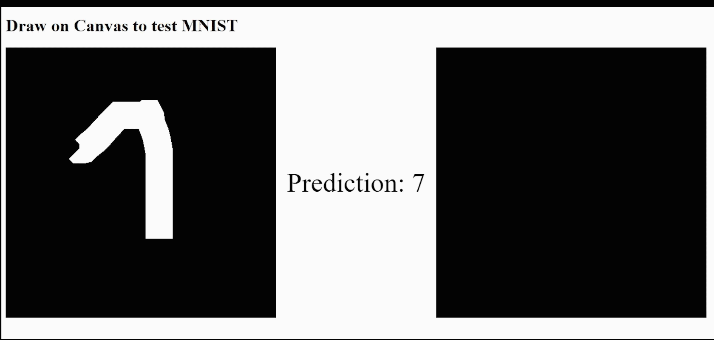

# Exploring Handwritten Digit Recognition with Keras and Flask

**2 min read.**



In the ever-evolving field of artificial intelligence, one of the fundamental tasks that has captivated researchers and enthusiasts alike is handwritten digit recognition. This seemingly simple problem, encapsulated by the MNIST dataset, serves as a crucial benchmark for developing and evaluating machine learning models. Today, we explore a fascinating project that leverages Keras and Flask to create a web application for real-time digit recognition, demonstrating the practical applications of AI in an accessible and interactive manner.

[Link to the Github repo](https://github.com/louispaulet/MNIST-KERAS-FLASK-JS)

## The Intersection of Keras and Flask: Bringing AI to the Web

The project in focus showcases how machine learning models can be seamlessly integrated into web applications using Keras, a powerful deep learning library, and Flask, a lightweight web framework. This combination allows developers to deploy sophisticated AI models in a user-friendly environment, making the technology accessible to a broader audience.

### Key Features of the Application

- **MNIST Digit Recognition**: At its core, the application utilizes a Keras-based model trained on the MNIST dataset to recognize handwritten digits.
- **Flask Server**: The backend, powered by Flask, serves the model and handles requests, making predictions based on user input.
- **Interactive Web Interface**: Users can either upload images or draw digits on an HTML canvas, receiving instant predictions from the model.

## Building and Running the Application

The project is designed to be straightforward to set up and use, with detailed instructions provided for both local deployment and Docker-based deployment.

### Local Setup

To get started locally, ensure you have the required Python packages installed:

- Flask==2.1.1
- Flask-CORS==3.0.10
- tensorflow==2.6.0
- Keras==2.6.0
- numpy==1.19.5
- Pillow==9.0.1
- protobuf==3.20.1

You can install these dependencies by running:

```bash
pip install -r requirements.txt
```

### Docker Setup

For those who prefer using Docker, the project provides a convenient Dockerfile. To build and run the Docker image, execute the following commands in your project directory:

```bash
docker build -t mnist-keras-flask-js .
docker run -p 5000:5000 mnist-keras-flask-js
```

Once the application is running, it can be accessed at `http://127.0.0.1:5000`.

## Using the Application

The web application features two main pages for testing the model:

1. **test-api.html**: This page allows users to upload an image of a handwritten digit. The model processes the image and displays the predicted digit below the upload form.
2. **canvas_drawing.html**: This interactive page provides an HTML canvas where users can draw a digit. The model predicts the digit in real-time, displaying the result next to the canvas.

To access these pages, navigate to the following URLs in your web browser:

- [Upload Test](http://127.0.0.1:5000/static/test-api.html)
- [Canvas Drawing](http://127.0.0.1:5000/static/canvas_drawing.html)

## Conclusion

This project is a shining example of how AI can be brought to life in practical, engaging ways. By combining the robust capabilities of Keras for deep learning with the simplicity and flexibility of Flask for web development, it provides a powerful tool for exploring digit recognition. Whether for educational purposes, personal interest, or as a stepping stone to more complex AI applications, this project illustrates the transformative potential of integrating machine learning into everyday technology.

As artificial intelligence continues to advance, projects like this not only highlight the progress being made but also inspire new innovations. By making AI more accessible and interactive, we can empower a broader audience to engage with and benefit from these cutting-edge technologies.

*Published on 23 Mar 2023.*