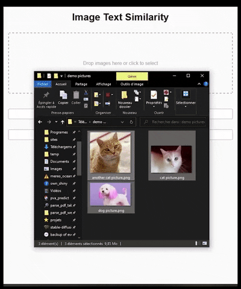

# OpenAI CLIP labelling and searching

**3 min read.**



## Disruptive Text-to-Image Embeddings: A Technological Marvel
The concept of embedding text and images into a shared latent space is transformative. Traditionally, AI models have struggled to bridge the semantic gap between visual and linguistic information. However, OpenAI's CLIP model leverages vast datasets and advanced neural architectures to align textual and visual embeddings, enabling it to understand and match images with their most relevant textual descriptions with unprecedented accuracy.

Imagine a system where you can input a detailed description of a scene, and the AI can retrieve or generate an image that perfectly matches the description. This is the power of text-to-image embeddings, and CLIP is at the forefront of this technological revolution. Its ability to comprehend context, nuance, and semantics across different types of data makes it an invaluable tool in fields ranging from content creation to e-commerce.

## Real-World Application: A Case Study
One fascinating application of the CLIP model is showcased in a recent project combining Flask and React to create a web application for image-text matching. This project exemplifies how cutting-edge AI can be harnessed to build user-friendly tools that solve real-world problems.

The web application allows users to upload images and input text descriptions. By leveraging CLIP, the application calculates the best matching text for each image, displaying the results in a clear and accessible format. This isn't just a theoretical exercise; it's a practical tool with a wide array of potential uses.

[Link to the Github repo](https://github.com/louispaulet/OpenAI_CLIP-REACT-FLASK)

This repository contains a Flask and React-based web application for finding the best matching text description for a set of images using OpenAI's CLIP model. The application provides a user-friendly interface for uploading images, inputting text descriptions, and displaying the best matching text for each image.

## Features 

- Drag and drop or select images to analyze
- Enter two text descriptions to compare
- Best matching text for each image is calculated using the CLIP model
- Cosine similarity is used to measure the similarity between image and text embeddings
- Results are displayed in a list, with image thumbnails and corresponding best matching text

## Repository Structure 

The repository is organized into two main folders: `clip-filter-backend` and `clip-filter-frontend`.

### `clip-filter-backend` 

This folder contains the Flask backend for the application. The backend consists of a single API endpoint, `/image_text_similarity_best_match`, which accepts an image and two text descriptions as input and returns the best matching text description for the image.

- `Dockerfile`: Configuration for building the backend Docker container
- `app.py`: Main Flask application file, containing the API endpoint and the CLIP model integration
- `test_unit.py`: Unit tests for the backend
- `test_integration.py`: Integration tests for the backend

### `clip-filter-frontend` 

This folder contains the React frontend for the application. The frontend provides a user interface for uploading images, inputting text descriptions, and displaying the results.

- `Dockerfile`: Configuration for building the frontend Docker container
- `src/App.js`: Main React component, containing the application logic and user interface

### Other Files 

- `docker-compose.yml`: Configuration for running the frontend and backend services using Docker Compose
- `run_tests.sh`: Shell script to run unit and integration tests using Docker Compose

## Getting Started 

### Prerequisites 

- Docker
- Docker Compose

### Running the Application 

1. Clone the repository:

    ```bash
    git clone https://github.com/louispaulet/OpenAI_CLIP-REACT-FLASK.git
    ```

2. Change to the repository directory:

    ```bash
    cd OpenAI_CLIP-REACT-FLASK
    ```

3. Build and run the application using Docker Compose:

    ```bash
    docker-compose up --build
    ```

4. Access the application in your web browser at [http://localhost](http://localhost).

### Running Unit and Integration Tests 

Before running the tests, make sure you have Docker and Docker Compose installed on your system. To run the unit and integration tests, follow these steps:

1. Make sure the `run_tests.sh` script (in the project root directory) is executable. In your terminal or command prompt, run the following command:

    ```bash
    chmod +x run_tests.sh
    ```

2. Run the tests using the script:

    ```bash
    ./run_tests.sh
    ```

    Note: If you're on Windows, use the `run_tests.bat` batch file to run the tests. Simply execute the following command:

    ```bash
    run_tests.bat
    ```

The script will start the backend and frontend services, wait for them to be up and running, execute the unit and integration tests, and then stop the backend and frontend services. The test results will be displayed in the console.


*Published on 23 Mar 2023.*
