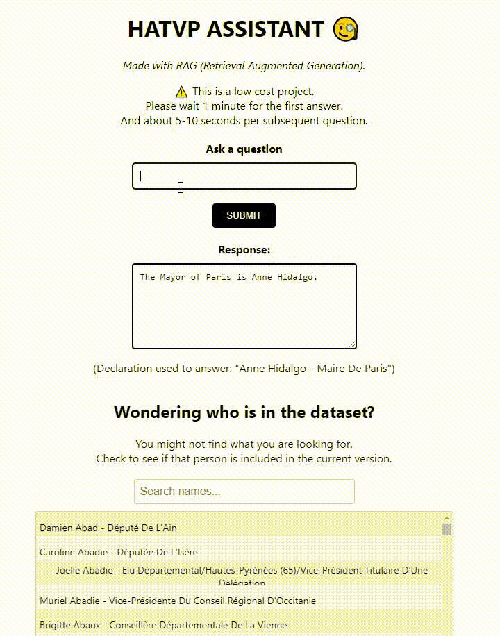

# Introducing the HATVP RAG Assistant Project: Enhancing Transparency in Public Declarations



[Try it now! - Please be patient as ressources are allocated on the spot](https://hatvp-rag.thefrenchartist.dev/)

Welcome to an exciting journey through the HATVP RAG Assistant project! This innovative initiative leverages cutting-edge technologies to facilitate transparency and access to public declarations submitted by French representatives. Let's dive into the details of this project, from its preparation phase to the backend operations, and explore how it seamlessly integrates with the frontend to deliver valuable insights to users.

### Project Overview

The HATVP RAG Assistant project is designed to streamline the process of querying and retrieving public declarations from the French High Authority for Transparency in Public Life (HATVP). By utilizing advanced natural language processing (NLP) models and embedding techniques, this project ensures that users can easily access relevant information from a vast collection of declarations. 

### Preparation Phase

Before delving into the technical specifics, let's explore the crucial preparatory steps that set the foundation for this project:

1. **Data Acquisition**:
   - **Source**: The open data XML file is downloaded from HATVP.fr, containing all the declarations submitted by public representatives.
   
2. **Data Transformation**:
   - **Conversion**: Individual declarations are converted from XML to JSON format, reducing the character count by 30% during LLM inference.
   
3. **Index Creation**:
   - **Extraction**: Key details such as name, surname, and job title are extracted from the declarations to create a text index.
   
4. **Vector Embeddings**:
   - **Embedding Model**: The OpenAI large embedding model is used to compute vectors for each text in the text index.
   
5. **Dataset Storage**:
   - **Hugging Face**: The processed dataset is saved to Hugging Face, enabling easy access and management.

### Backend Operations

The backend of the HATVP RAG Assistant is where the magic happens. Written in Python using Flask, it handles user queries, processes data, and interacts with language models to generate responses. Here's a detailed look at the backend code:

```python
from flask import Flask, request, jsonify
import os
import json
import numpy as np
from datasets import load_dataset
from openai import OpenAI
from langchain.schema.output_parser import StrOutputParser
from langchain_core.prompts import ChatPromptTemplate
from langchain_groq import ChatGroq
import tiktoken
from flask_cors import CORS

app = Flask(__name__)
CORS(app)

# Load environment variables
OPENAI_API_KEY = os.getenv("OPENAI_API_KEY")
GROQ_API_KEY = os.getenv("GROQ_API_KEY")

client = OpenAI(api_key=OPENAI_API_KEY)
embed_ds = load_dataset("the-french-artist/hatvp_declarations_text_index_embeds", split='train')
embed_ds.add_faiss_index(column='text_index_embedding')

def num_tokens_from_string(string: str, encoding_name: str) -> int:
    encoding = tiktoken.get_encoding(encoding_name)
    num_tokens = len(encoding.encode(string))
    return num_tokens

def truncate_text_to_stay_under_openai_embedding_limit(input_text):
    backup_input_text = input_text
    openai_embed_limit = 8192
    delta = num_tokens_from_string(input_text, "cl100k_base") - openai_embed_limit
    while delta > 0:
        input_text = input_text[:-int(delta*2)]  # Speed up the process with factor 2
        delta = num_tokens_from_string(input_text, "cl100k_base") - openai_embed_limit
    return input_text if len(input_text) > 0 else backup_input_text[:8000]

def get_embedding(text, model="text-embedding-3-large"):
    text = text.replace("\n", " ")
    text = truncate_text_to_stay_under_openai_embedding_limit(text)
    return client.embeddings.create(input=[text], model=model).data[0].embedding

def perform_query(query, n_samples=1):
    query_embed = np.array(get_embedding(query.lower()))
    scores, retrieved_examples = embed_ds.get_nearest_examples('text_index_embedding', query_embed, k=n_samples)
    return [text.title() for text in retrieved_examples['text_index']], retrieved_examples['declaration_json']

def get_name_surname_from_str_declaration(input_str_json):
    parsed_json = json.loads(input_str_json)
    return parsed_json['declaration']['general']['declarant']['nom'], parsed_json['declaration']['general']['declarant']['prenom']

def get_answer_to_question(question, llm_to_use):
    system = """You are an assistant for question-answering tasks.
    Use the following pieces of retrieved context to answer the question.
    If you don't know the answer, just say that you don't know.
    Use three sentences maximum and keep the answer concise.
    """
    human = "{text}"
    prompt = ChatPromptTemplate.from_messages([("system", system), ("human", human)])
    
    declaration_id, declaration_content = perform_query(question, 1)
    context = ''.join(declaration_content)  # Concatenate top results into a context
    actual_prompt = f"""
    Question: {question}
    Context: {context}
    Answer:
    """
    
    chain = prompt | llm_to_use | StrOutputParser()
    return declaration_id, chain.invoke({"text": actual_prompt})

@app.route('/ask', methods=['POST'])
def ask_question():
    data = request.json
    question = data.get('question')
    llm_llama3_70B = ChatGroq(temperature=0, model_name="llama3-70b-8192")
    declaration_id, answer = get_answer_to_question(question, llm_llama3_70B)
    return jsonify({'answer': answer, 'declaration_id': declaration_id})

if __name__ == '__main__':
    app.run(host='0.0.0.0', port=5000)
```

### API Execution Flow

1. **Dataset Loading**:
   - The preprocessed dataset is loaded from Hugging Face and indexed using FAISS for efficient similarity searches.

2. **Query Processing**:
   - When a user submits a query, the backend calls the OpenAI embedding system to find the best match in the text index.

3. **Retrieval**:
   - The JSON declaration corresponding to the best match is retrieved.

4. **Contextual Processing**:
   - This declaration is added to the context and sent to the GROQ model for inference.

5. **Response Generation**:
   - The response, along with the declaration ID, is sent back to the user.

### Frontend Integration

The frontend of the HATVP RAG Assistant project is designed to provide a user-friendly interface for interacting with the backend API. Users can easily submit queries and receive responses enriched with contextual information from the public declarations. The frontend project is available on GitHub:

- **Frontend Project Repository**: [HATVP RAG Frontend](https://github.com/louispaulet/hatvp_rag_front)

### Conclusion

The HATVP RAG Assistant project exemplifies the power of modern AI and NLP technologies in promoting transparency and accessibility. By efficiently processing and retrieving relevant public declarations, it empowers users to gain insights and information with ease. Whether you're a researcher, journalist, or an interested citizen, this tool opens up a new world of possibilities in understanding public representatives' declarations.

Explore the project on GitHub:
- **Backend Project Repository**: [HATVP RAG Backend](https://github.com/louispaulet/hatvp_rag_api)

Feel free to contribute, provide feedback, or simply enjoy the enhanced access to public information through the HATVP RAG Assistant. Happy querying!

*Published 24 Jun 2024.*